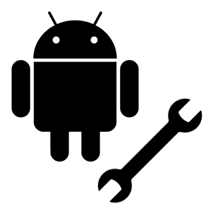
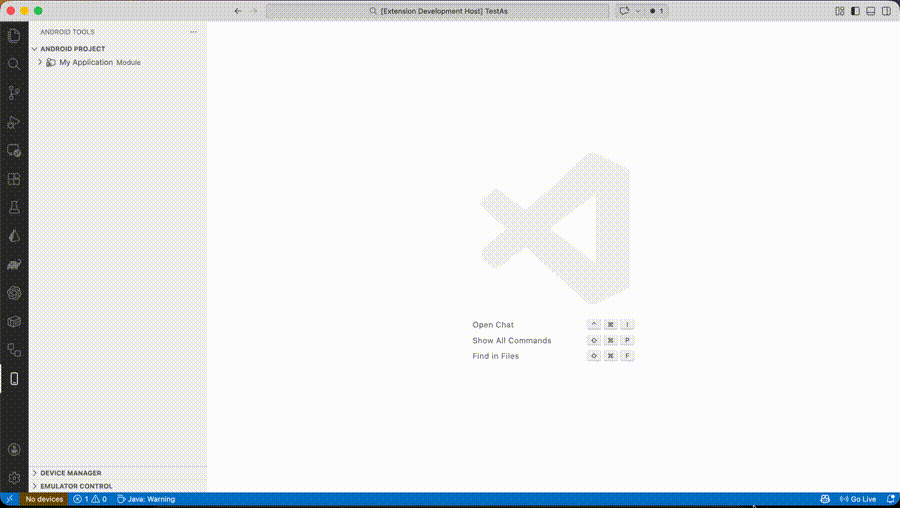
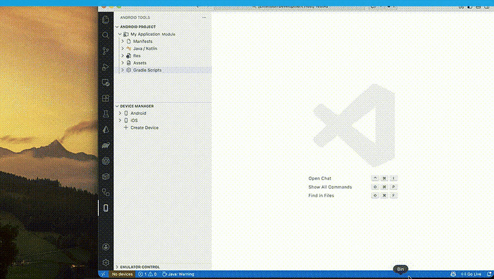

  

# Android Tools for VS Code

> **Run, debug, and control Android apps in VS Code — without Android Studio.**

**Android Sidecar** is a lightweight, open‑source VS Code extension that brings the *most frequently used* Android Studio workflows directly into VS Code.

It is **not** a replacement for Android Studio.  
It is a **sidecar** — focused on speed, simplicity, and daily developer needs.

---

## Why Android Sidecar?

Most Android developers open Android Studio just to:

- start an emulator
- run or reinstall an app
- view Logcat
- do basic debugging

Everything else already happens in VS Code.

**Android Sidecar removes that friction.**

---

## Key Features

### Fast Android Runner
- Automatic Android SDK & ADB detection
- List available Android Virtual Devices (AVDs)
- Start / stop emulators
- Install APKs or debug builds
- Run your app on a selected emulator (build, install, launch)
- Device discovery via `adb devices`
- Clear run & device status indicators

---

### Android Project View
Android‑Studio‑inspired logical project structure:

- **Manifests**
- **Java / Kotlin** (package‑aware)
- **Res**
- **Assets**
- **Gradle Scripts**

Project view actions:
- Create Kotlin/Java classes
- Create files and folders
- Rename and delete items
- Drag & drop to move files between folders

---

### Emulator Control
Control Android emulators directly from VS Code:

- Screen rotation
- Screenshot capture
- Cold / warm boot
- Wipe data
- Network on / off
- Battery simulation (level & charging)
- GPS location mocking *(planned)*

---

### Logcat Viewer
Minimal, fast Logcat experience:

- Live Logcat stream
- Filter by package, tag, or log level
- Clear logs instantly
- Device‑aware log streams

---

## Debugging (Minimal)
Focused on everyday debugging — not full Android Studio replacement.

- Breakpoints
- Stack traces
- Variable inspection
- Attach / detach debugger

---

## New Project Wizard
Create a clean Android project from VS Code:
- App name, package name, language
- App module with Activity, manifest, resources
- Gradle files generated (wrapper if Gradle is available)

## Commands
- `Android: List Devices`
- `Android: Start Emulator`
- `Android: Stop Emulator`
- `Android: Create Emulator`
- `Android: Run App on Emulator`
- `Android: Install APK`
- `Android: Uninstall App`
- `Android: Restart App`
- `Android: Open Logcat Viewer`
- `Android: Clear Logcat`
- `Android: Rotate Screen`
- `Android: Take Screenshot`
- `Android: Cold Boot`
- `Android: Warm Boot`
- `Android: Wipe Data`
- `Android: Toggle Network`
- `Android: Set Location`
- `Android: Start Screen Recording`
- `Android: Stop Screen Recording`
- `Android: Set Battery Level`
- `Android: Attach Debugger`
- `Android: Detach Debugger`
- `Android: Toggle Breakpoint`
- `Android: Debug Status`
- `Android: Open Emulator Control`
- `Android: Open Performance Profiler`
- `Android: Create Resource`
- `Android: Create Class`
- `Android: Create File`
- `Android: Create Folder`
- `Android: Create Asset`
- `Android: Create Language/Locale`
- `Android: New Project`

## Roadmap

### Phase 1 — Core (MVP)
- Fast Android Runner
- Android Project View
- Emulator Control (basic)
- Logcat Viewer

### Phase 2 — Debug & DX
- Minimal Android Debugger
- Project Setup Assistant
- Emulator auto‑sync & stability improvements

### Phase 3 — Advanced (Optional)
- Advanced emulator controls
- Performance snapshots (CPU, memory)
- App startup timing

> ⚠️ Advanced profiling is intentionally postponed due to complexity.

---

## Out of Scope

Android Sidecar **will not** include:

- Layout Editor
- UI Designer
- Full Android Studio replacement
- Custom Gradle build systems

> Philosophy: *Stay fast. Stay focused.*

---

## How It Works

- Built on the VS Code Extension API
- Powered by existing Android CLI tools:
  - `adb`
  - `emulator`
  - `avdmanager`
- No background daemons
- No hidden magic

---

## Requirements

- Android SDK
- ADB
- Android Emulator
- VS Code (latest stable)
- JDK 17+ (recommended JDK 21 for Kotlin language server)

Optional:
- Debugger for Java extension (for debugging)
- Kotlin Language extension (for Kotlin support)
  - If Kotlin server crashes, use JDK 21 and set `JAVA_HOME` to it

---

## Contributing

Android Sidecar is open‑source and community‑driven.

- Feature ideas
- Bug reports
- Pull requests

are all welcome

---

## License

MIT

---

> **Android Sidecar for VS Code**  
> Android development — without fighting your IDE.
